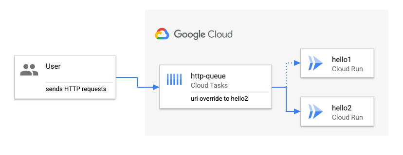

# Create HTTP target tasks more easily with the BufferTask API

> **Note:** *Queue-level task routing configuration* and *BufferTaskAPI* are
> features in *public preview*.

In the previous [Create a queue with HTTP uri
override](../queue-uri-override-http-tasks/) sample, we created a queue with
some default HTTP uri overrides. In this sample, you'll see how to take
advantage of the queue-level HTTP uri overrides and the BufferTask API to create
HTTP target tasks more easily by simply sending an HTTP request.



## What is BufferTask API?

The CreateTask API is the old way of creating Tasks and requires the client to
send in a Task object to the API with all the required fields set.

BufferTask is a new API that allows the users to create an HTTP Task without the
need to provide any Task Configuration (HTTP URL, headers, authorization),
allowing you to simply send a message or the body of your request to the Buffer
API.

This enables easier integration with services as Cloud Tasks can now be deployed
in front of your service without needing any code changes on the client side.
Any arbitrary HTTP request sent to the BufferTask API will be wrapped as a Task
object and delivered to the destination set at the queue-level.

To use the BufferTask API, the queue needs to have the Target URI configuration
set, or in other words, the previous feature: Queue-level routing configuration
is a prerequisite for using the BufferTask API.

## Create a Cloud Tasks queue with uri override

Create a queue with a HTTP target uri override pointing to the first service we
deployed in the first sample.

```sh
SERVICE1=hello1
SERVICE1_URL=$(gcloud run services describe $SERVICE1 --region $REGION --format 'value(status.url)')
SERVICE1_HOST=$(echo $SERVICE1_URL | sed 's,http[s]*://,,g')
QUEUE=http-queue-uri-override-buffer
LOCATION=us-central1

gcloud beta tasks queues create $QUEUE \
  --http-uri-override=host:$SERVICE1_HOST \
  --location=$LOCATION
```

You can describe the queue:

```sh
gcloud beta tasks queues describe $QUEUE --location=$LOCATION
```

And you should see the uri override:

```sh
httpTarget:
  uriOverride:
    host: hello1-idcwffc3yq-uc.a.run.app
    pathOverride: {}
    queryOverride: {}
...
```

Pause the queue temporarily, so we can observe HTTP tasks as they are created:

```sh
gcloud tasks queues pause $QUEUE --location=$LOCATION
```

## Create an HTTP task with BufferTask API

First, login to get an access token and set some variables:

```sh
gcloud auth application-default login
ACCESS_TOKEN=$(gcloud auth application-default print-access-token)
PROJECT_ID=$(gcloud config get-value project)
TASKS_QUEUES_API="https://cloudtasks.googleapis.com/v2beta3/projects/$PROJECT_ID/locations/$LOCATION/queues"
```

Create an HTTP task with BufferTask API. Notice how it's a simple a HTTP GET
request to the BufferTask API without the need for creating a Task:

```sh
curl -X GET "$TASKS_QUEUES_API/$QUEUE/tasks:buffer" \
  -H "Authorization: Bearer $ACCESS_TOKEN"
```

You can also create another HTTP task with HTTP POST and a body:

```sh
curl -X POST "$TASKS_QUEUES_API/$QUEUE/tasks:buffer" \
  -H "Authorization: Bearer $ACCESS_TOKEN" \
  -d "{'message': 'Hello World'}"
```

You can also create an HTTP task with client libraries. For example, you can
check out the [Program.cs](./client-libraries/csharp/Program.cs) for a C# sample
where an HTTP GET request is sent directly to the BufferTask API without having
to wrap it into a `Task` or needing the client-library for Cloud Tasks:

```csharp
var BufferTaskApiUrl = $"https://cloudtasks.googleapis.com/v2beta3/projects/{ProjectId}/locations/{Location}/queues/{Queue}/tasks:buffer";

using (var client = new HttpClient())
{
    client.DefaultRequestHeaders.Add("Authorization", $"Bearer {AccessToken}");
    var response = await client.GetAsync(BufferTaskApiUrl);
    var content = await response.Content.ReadAsStringAsync();
    Console.WriteLine($"Response: {content}");
}
```

You can run it as follows:

```sh
dotnet run $PROJECT_ID $LOCATION $QUEUE $ACCESS_TOKEN
```

BufferTask API takes care of creating a Task out of the HTTP requests and adds
the URL from the queue uri override.

## Test the HTTP task with BufferTask API

Resume the queue:

```sh
gcloud tasks queues resume $QUEUE --location=$LOCATION
```

You should see that the Cloud Run service received an HTTP GET and POST requests from
Cloud Tasks:

```sh
gcloud logging read "resource.type=cloud_run_revision AND resource.labels.service_name=$SERVICE1" --limit 4
---
httpRequest:
  latency: 0.002279292s
  protocol: HTTP/1.1
  remoteIp: 35.243.23.42
  requestMethod: POST
  requestSize: '777'
  requestUrl: https://hello1-idcwffc3yq-uc.a.run.app/
  responseSize: '5450'
  serverIp: 216.239.32.53
  status: 200
  userAgent: Google-Cloud-Tasks
...
httpRequest:
  latency: 0.228982142s
  protocol: HTTP/1.1
  remoteIp: 35.187.132.84
  requestMethod: GET
  requestSize: '426'
  requestUrl: https://hello1-idcwffc3yq-uc.a.run.app/
  responseSize: '5510'
  serverIp: 216.239.34.53
  status: 200
  userAgent: Google-Cloud-Tasks
```
