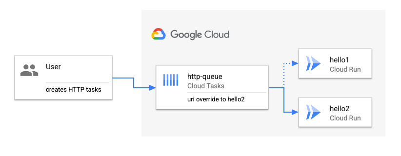

# Create a queue with HTTP uri override

> **Note:** *Queue-level task routing configuration* is an experimental feature
> in *preview*. Only allow-listed projects can currently take advantage of it.

This sample builds on the previous [Create a regular queue for HTTP target
tasks](../queue-http-tasks/) sample. Make sure you go through that sample before
continuing with this one.

In this sample, you'll see how to:

1. Create a Cloud Tasks queue with a uri override using the *Queue-level Task
   Routing Configuration* feature and add HTTP tasks to it to target a secondary
   Cloud Run service.
1. Change pending tasks in the queue to target a new uri using the uri override.



## What is Queue-level task routing configuration?

Queue-level task routing configuration changes the HTTP task routing for the
entire queue for all pending and new tasks. This allows easier creation of Tasks
as the HTTP target need not be set at the Task level and it shifts more control
to the service provider as they are able to set the target of all Tasks in a
queue (eg. route traffic to a different backend if the original backend is
down).

The following configuration can be set at the queue-level:

* **Headers**: Queue-level headers when specified at the queue-level, will upsert
  headers for all Tasks in the queue.
* **HTTP Method**: HTTP method when specified at the queue-level, will override the
  HTTP method for all Tasks in the queue.
* **Target URI**: host, path, query, port, scheme (HTTP or HTTPS) can be
  individually overridden.
* **Authorization**: OIDC/OAuth config when specified at the queue-level will
  override the Task-level OIDC/OAuth config.

## Deploy a second Cloud Run service

Deploy a second Cloud Run service which will serve as the target of the HTTP uri
override later:

```sh
SERVICE2=hello2
REGION=us-central1

gcloud run deploy $SERVICE2 \
  --allow-unauthenticated \
  --image=gcr.io/cloudrun/hello \
  --region=$REGION
```

Save the host part of URL of the service for later:

```sh
SERVICE2_URL=$(gcloud run services describe $SERVICE2 --region $REGION --format 'value(status.url)')
SERVICE2_HOST=$(echo $SERVICE2_URL | sed 's,http[s]*://,,g')
```

## Setup

*Queue-level Task Routing Configuration* is currently an experimental feature.
As such, it doesn't have `gcloud` support. Instead, we will use `curl`.

First, login and get an access token:

```sh
gcloud auth application-default login
ACCESS_TOKEN=$(gcloud auth application-default print-access-token)
```

Set some environment variables that we'll use later:

```sh
PROJECT_ID=$(gcloud config get-value project)
LOCATION=us-central1
QUEUES_PATH=projects/$PROJECT_ID/locations/$LOCATION/queues
TASKS_API="https://cloudtasks.googleapis.com/v2beta3"
TASKS_QUEUES_API=$TASKS_API/$QUEUES_PATH
```

## Create a Cloud Tasks queue with uri override

Create a queue with a HTTP target uri override. Note that, the uri override
refers to the second Cloud Run service. Any HTTP task added to the queue will
have its uri host overridden by service2's host:

```sh
QUEUE=http-queue-uri-override

curl -X POST $TASKS_QUEUES_API \
  -H "Authorization: Bearer $ACCESS_TOKEN" \
  -H "Content-Type: application/json" \
  -d @- << EOF
{
  "name": "$QUEUES_PATH/$QUEUE",
  "httpTarget": {"uriOverride":{"host":"$SERVICE2_HOST"}}
}
EOF
```

You can see the queue configuration:

```sh
curl -X GET $TASKS_QUEUES_API/$QUEUE \
  -H "Authorization: Bearer ${ACCESS_TOKEN}"
```

Pause the queue temporarily, so we can observe HTTP tasks as they are created:

```sh
gcloud tasks queues pause $QUEUE \
    --location=$LOCATION
```

## Create an HTTP task

Create an HTTP task. Note that we're using the first service's URL still but
this will be overridden by the queue later:

```sh
gcloud tasks create-http-task \
    --queue=$QUEUE \
    --location=$LOCATION \
    --url=$SERVICE1_URL \
    --method=GET
```

At this point, the task is created but it's in pending state as the queue is
paused:

```sh
gcloud tasks queues list \
  --location=$LOCATION

QUEUE_NAME               STATE    MAX_NUM_OF_TASKS  MAX_RATE (/sec)  MAX_ATTEMPTS
http-queue               RUNNING  1000              500.0            100
http-queue-uri-override  PAUSED   1000              500.0            100
```

## Test the HTTP task with uri override

Resume the queue:

```sh
gcloud tasks queues resume $QUEUE \
    --location=$LOCATION
```

You should see that the second (not the first) Cloud Run service received an HTTP GET request from
Cloud Tasks due to the override:

```sh
gcloud logging read "resource.type=cloud_run_revision AND resource.labels.service_name=$SERVICE2" --limit 1
---
httpRequest:
  latency: 0.228982142s
  protocol: HTTP/1.1
  remoteIp: 35.187.132.84
  requestMethod: GET
  requestSize: '426'
  requestUrl: https://hello2-idcwffc3yq-uc.a.run.app/
  responseSize: '5510'
  serverIp: 216.239.34.53
  status: 200
  userAgent: Google-Cloud-Tasks
```

## Change the pending tasks with uri override

You can also use the uri override to change the uri of pending tasks.

Pause the queue again, so we can observe HTTP tasks as they are created:

```sh
gcloud tasks queues pause $QUEUE \
    --location=$LOCATION
```

Create an HTTP task. Note that we're using the `google.com` as the task URL:

```sh
gcloud tasks create-http-task \
    --queue=$QUEUE \
    --location=$LOCATION \
    --url=https://www.google.com \
    --method=GET
```

The task is in pending state as the queue is paused.

Now, update the HTTP uri override to point to the first service. This will override
the pending task's host from `google.com` to the first service's host:

```sh
SERVICE1_URL=$(gcloud run services describe $SERVICE1 --region $REGION --format 'value(status.url)')
SERVICE1_HOST=$(echo $SERVICE1_URL | sed 's,http[s]*://,,g')

curl -X PATCH "$TASKS_QUEUES_API/$QUEUE?updateMask=httpTarget.uriOverride" \
  -H "Authorization: Bearer $ACCESS_TOKEN" \
  -H "Content-Type: application/json" \
  -d @- << EOF
{"httpTarget": {"uriOverride":{"host":"$SERVICE1_HOST"}}}
EOF
```

Resume the queue:

```sh
gcloud tasks queues resume $QUEUE \
    --location=$LOCATION
```

You should see that the first Cloud Run service received an HTTP GET request from
Cloud Tasks due to the override (instead of `google.com`):

```sh
gcloud logging read "resource.type=cloud_run_revision AND resource.labels.service_name=$SERVICE1" --limit 1
---
httpRequest:
  latency: 0.228982142s
  protocol: HTTP/1.1
  remoteIp: 35.187.132.84
  requestMethod: GET
  requestSize: '426'
  requestUrl: https://hello1-idcwffc3yq-uc.a.run.app/
  responseSize: '5510'
  serverIp: 216.239.34.53
  status: 200
  userAgent: Google-Cloud-Tasks
```
