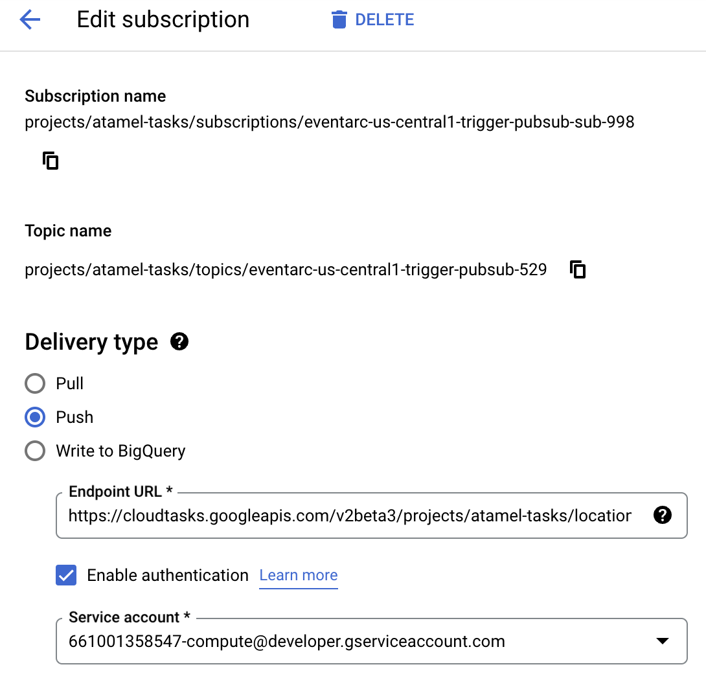

# Cloud Tasks as a buffer between Pub/Sub and Cloud Run

> **Note:** *Queue-level task routing configuration* and *BufferTaskAPI* are
> experimental features in *preview*. Only allow-listed projects can currently
> take advantage of it.

In this sample, you'll see how to use a Cloud Tasks queue as a buffer between
Pub/Sub and Cloud Run using the new *Queue-level task routing configuration* and
*BufferTaskAPI* features.

## Scenario

Imagine you have an application/user publishing messages to a Pub/Sub topic
managed by Eventarc and Eventarc routing those messages to a Cloud Run service:


Now, assume that the user is generating too many messages that are overwhelming
the Cloud Run service. In this case, you can integrate a Cloud Tasks queue as a
buffer to throttle the load. For this to work, you need to:

1. Create a Cloud Tasks queue with an uri override to point to the Cloud Run
   service.
1. Change the Pub/Sub subscription endpoint to the BufferTask API.


Let's see what it takes to set this up.

## Enable APIs

First, make sure the required APIs are enabled:

```sh
gcloud services enable \
  cloudtasks.googleapis.com \
  eventarc.googleapis.com \
  run.googleapis.com
```

## Deploy a Cloud Run service

Deploy a Cloud Run service to receive and log messages:

```sh
SERVICE=hello
REGION=us-central1

gcloud run deploy $SERVICE \
  --allow-unauthenticated \
  --image=gcr.io/cloudrun/hello \
  --region=$REGION
```

Save the host part of URL of the service for later:

```sh
SERVICE_URL=$(gcloud run services describe $SERVICE --region $REGION --format 'value(status.url)')
SERVICE_HOST=$(echo $SERVICE_URL | sed 's,http[s]*://,,g')
```

## Create an Eventarc Pub/Sub trigger

Connect the Cloud Run service to a Pub/Sub topic by creating an Eventarc
trigger:

```sh
TRIGGER=trigger-pubsub

gcloud eventarc triggers create $TRIGGER \
  --destination-run-service=$SERVICE \
  --destination-run-region=$REGION \
  --event-filters="type=google.cloud.pubsub.topic.v1.messagePublished" \
  --location=$REGION
  ```

Save the Pub/Sub topic for later:

```sh
TOPIC=$(gcloud eventarc triggers describe $TRIGGER --location $REGION --format='value(transport.pubsub.topic)')
```

## Test without a Cloud Tasks buffer

To simulate too many messages, send some messages in a loop to the Pub/Sub topic:

```sh
for i in {1..5}
do
  gcloud pubsub topics publish $TOPIC --message="Hello World$i" &
done
```

You should see in Cloud Run logs that messages arrived all at once,
potentially overwhelming the service:

```log
2023-01-17 14:16:06.698 GMT
Received event of type google.cloud.pubsub.topic.v1.messagePublished. Event data: Hello World3
2023-01-17 14:16:06.736 GMT
Received event of type google.cloud.pubsub.topic.v1.messagePublished. Event data: Hello World1
2023-01-17 14:16:06.744 GMT
Received event of type google.cloud.pubsub.topic.v1.messagePublished. Event data: Hello World2
2023-01-17 14:16:06.755 GMT
Received event of type google.cloud.pubsub.topic.v1.messagePublished. Event data: Hello World4
2023-01-17 14:16:06.759 GMT
Received event of type google.cloud.pubsub.topic.v1.messagePublished. Event data: Hello World5
```

Next, let's see how to buffer these messages using a Cloud Tasks queue.

## Setup for new Cloud Tasks features

*Queue-level Task Routing Configuration* is currently an experimental feature.
As such, it doesn't have `gcloud` support. Instead, we will use `curl`.

First, login and get an access token:

```sh
gcloud auth application-default login
ACCESS_TOKEN=$(gcloud auth application-default print-access-token)
```

Set some environment variables that we'll use later:

```sh
PROJECT_ID=$(gcloud config get-value project)
LOCATION=us-central1
QUEUES_PATH=projects/$PROJECT_ID/locations/$LOCATION/queues
TASKS_API="https://cloudtasks.googleapis.com/v2beta3"
TASKS_QUEUES_API=$TASKS_API/$QUEUES_PATH
```

## Create a Cloud Tasks queue with uri override

Create a queue with a HTTP target uri override pointing to the Cloud Run
service. Also apply some rate limits to the queue. In this case, we're applying
1 dispatch per second:

```sh
QUEUE=pubsub-http-queue

curl -X POST $TASKS_QUEUES_API \
  -H "Authorization: Bearer $ACCESS_TOKEN" \
  -H "Content-Type: application/json" \
  -d @- << EOF
{
  "name": "$QUEUES_PATH/$QUEUE",
  "httpTarget": {"uriOverride":{"host":"$SERVICE_HOST"}},
  "rateLimits":{
    "maxDispatchesPerSecond":1,
    "maxBurstSize":1,
    "maxConcurrentDispatches":1
  }
}
EOF
```

## Configure Pub/Sub topic subscription with BufferTask API

As a final step, you need to change the Pub/Sub topic's subscription push endpoint
from Cloud Run url to Cloud Tasks BufferTask API.

In Cloud Console, go to Pub/Sub topics section, click on the topic of the
Eventarc trigger and then click on the only subscription of the topic.

Then, edit the topic. You'll see the Endpoint URL, here's an example:

```
https://hello-idcwffc3yq-uc.a.run.app?__GCP_CloudEventsMode=CUSTOM_PUBSUB_projects%2Fyour-project-id%2Ftopics%2Feventarc-us-central1-trigger-pubsub-529
```

Change the Cloud Run service url with the BufferTask API url for the queue, here's an example:

```
https://cloudtasks.googleapis.com/v2beta3/projects/your-project-id/locations/us-central1/queues/pubsub-http-queue/tasks:buffer?__GCP_CloudEventsMode=CUSTOM_PUBSUB_projects%2Fatamel-tasks%2Ftopics%2Feventarc-us-central1-trigger-pubsub-529
```

Make sure the `Enable authentication` checkbox under the endpoint URL is also
selected with a service account:



Click `Update` at the bottom to update the endpoint url.

## Test with a Cloud Tasks buffer

Everything is setup now. All the messages from Pub/Sub to Cloud Run will be
buffered through the Cloud Task queue at 1 message/second rate.

Let's send some messages in a loop to the Pub/Sub topic again:

```sh
for i in {1..5}
do
  gcloud pubsub topics publish $TOPIC --message="Hello World$i" &
done
```

You should see in Cloud Run logs that messages arrived at 1 second intervals and
not all at once!

```log
2023-01-17 15:47:28.868 GMT
Received event of type google.cloud.pubsub.topic.v1.messagePublished. Event data: Hello World3
2023-01-17 15:47:29.592 GMT
Received event of type google.cloud.pubsub.topic.v1.messagePublished. Event data: Hello World5
2023-01-17 15:47:30.581 GMT
Received event of type google.cloud.pubsub.topic.v1.messagePublished. Event data: Hello World4
2023-01-17 15:47:31.586 GMT
Received event of type google.cloud.pubsub.topic.v1.messagePublished. Event data: Hello World2
2023-01-17 15:47:32.589 GMT
Received event of type google.cloud.pubsub.topic.v1.messagePublished. Event data: Hello World1
```
